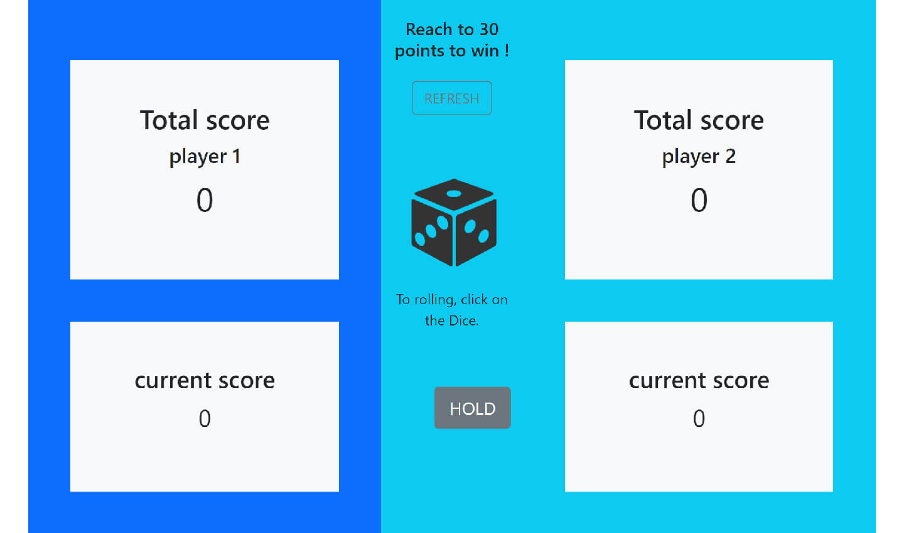

# Pig (dice game)

Users could be able to:

- Pig is a simple dice game. Players take turns to roll a single dice as many times as they wish, adding all roll results to a running total, but losing their gained score for the turn if they roll a 1.

### Screenshot

## Links

- Live Site URL: [Let's play Pig](https://hamed3958.github.io/pig-game)

### Built with

- HTML5
- BootStrap 5
- JavaScript

## Author

- Website - [hamedasadiasl.ir](http://hamedasadiasl.ir/)
- Github - [@hamed3958](https://github.com/hamed3958)
- LinkedIn - [Hamed Asadi Asl](https://www.linkedin.com/in/hamed-asadi-asl/)
